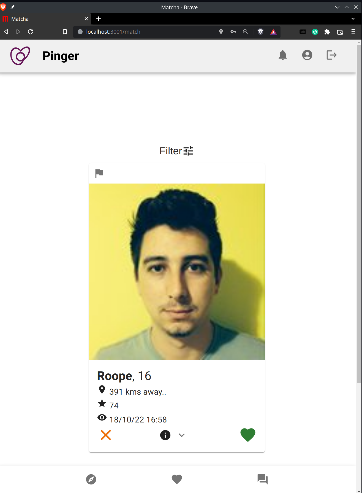
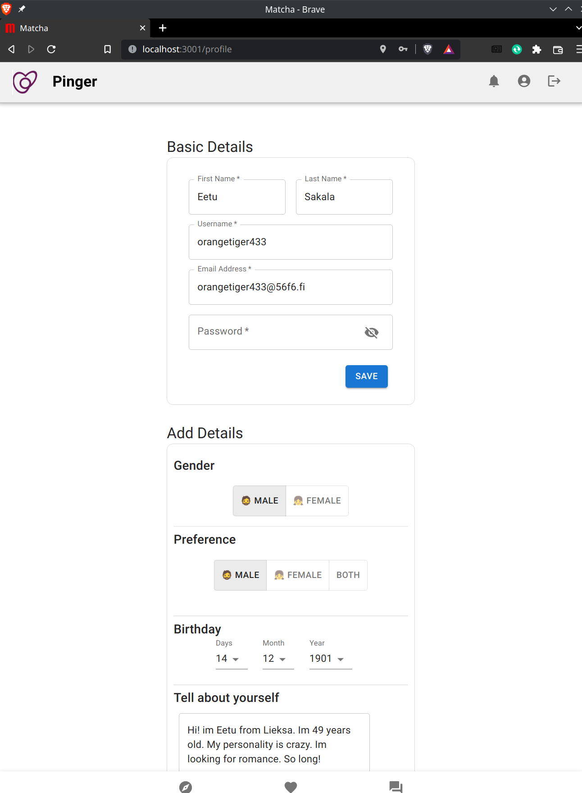
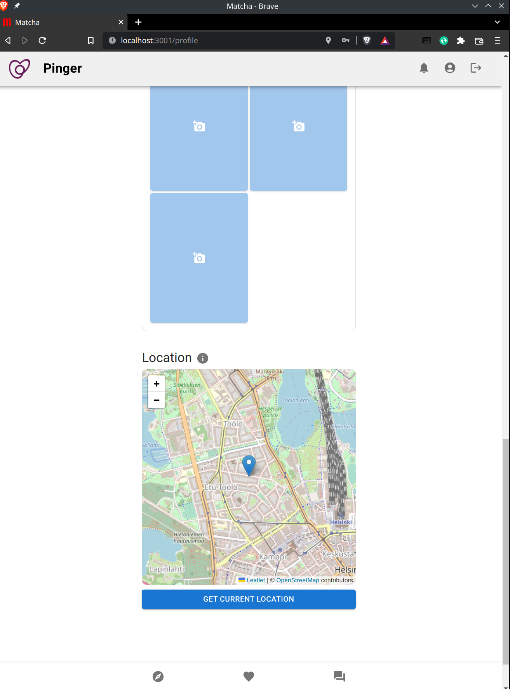
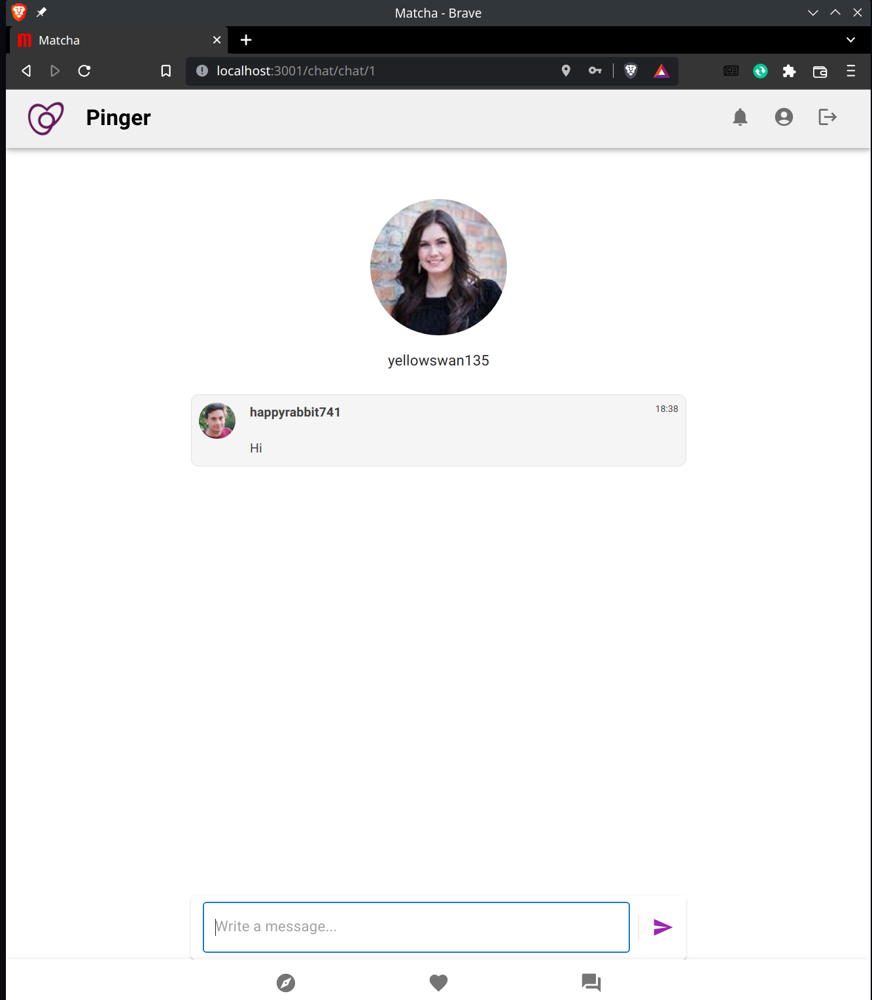
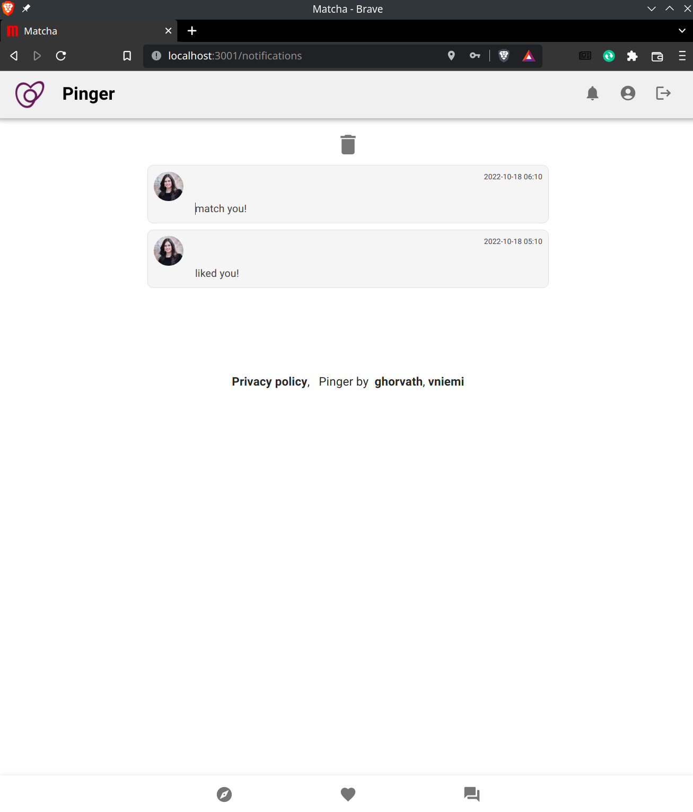
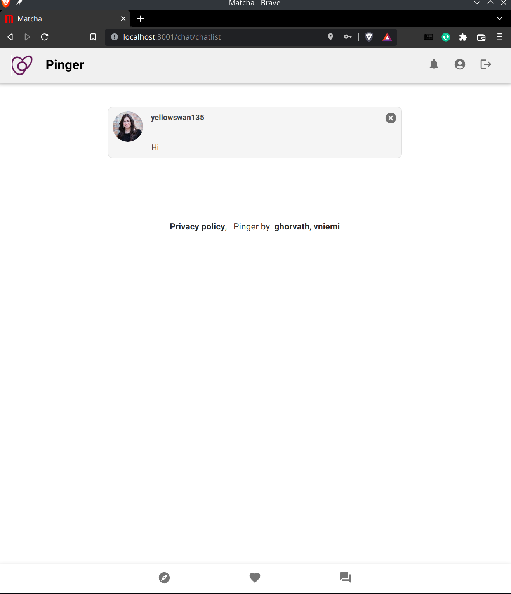

# Matcha

## by [ghorvath](https://github.com/mobahug), [vniemi](https://gitlab.com/vilniemi)

### Matcha is a dating site

First my primary focus was writing resuable orm and validators to make things more simple, (in the specifications we couldn't use those) And then design user interface that is both efficient, logical and easy to use.

My teammate started by writing chat to understand socket.io, then usergenerator so that we could easily test out the website. After that he worked
on study mui components and adding it to the website, while I was simultaneously working on backend.

After that we both worked on the backend and frontend together when unified the app together.

We decided to do mobile first since don't need to worry about small screens.

It was supposed to be one month project but we learned all new tools and concepts that took long time. As well as adding more things to the ui
that wasn't really needed, not good idea in retrospect but it make it look like can be satisfied in the result.

There was no time in the end to really refactor the code anymore or write tests for the ui, that was unfortunate. Learned a lot about teamwork how to see other is stuck and how to get faster in the end of the project by assigning tasks right.

## Technologies

Docker, Node.js, Express, React, Mui and PostgreSQL.

## Screenshots









## Installation:

Get docker [Docker](https://www.docker.com/) .

1. Clone the repository
2. Add to `.env` your email address and password

```
EMAIL_ADDRESS = <your email address>
EMAIL_PASSWORD = <your email password>
```

3. To build and start run: ./start-server.zsh
4. Go to `localhost:3001` in your browser

## Other tools

### access different containers

./access_client.zsh
./access_server.zsh
./access_db.zsh

directly access postgress manager
./postgress

### remove all containers

./remove_containers.zsh

### run tests inside server

./run_tests.zsh

### postgres dump and migration

./migrate_from_dump.zsh
./get_dump.zsh

### generate random users to db

./db_migrate_add_users.zsh
